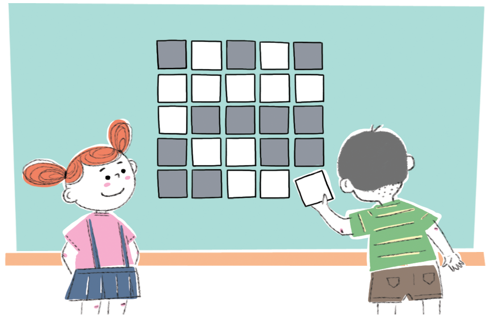
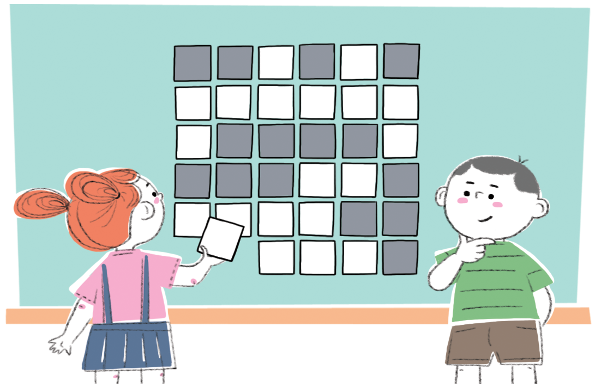
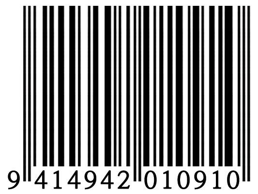
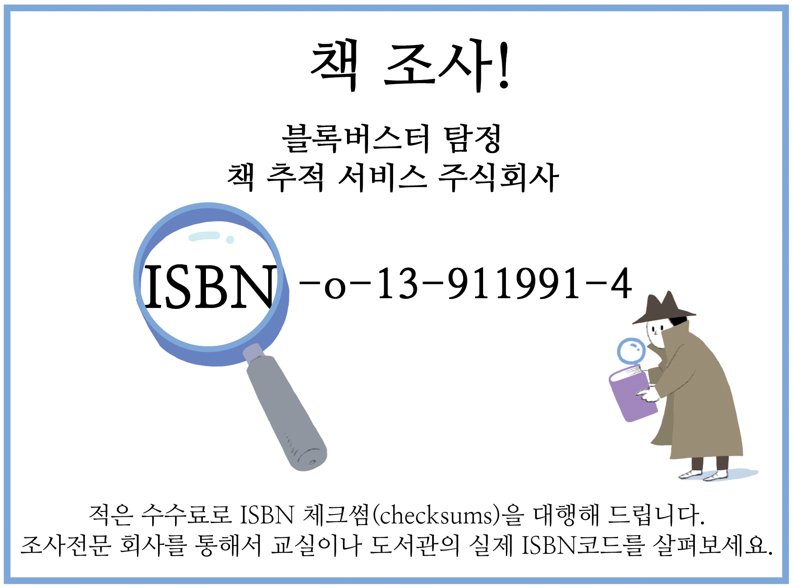
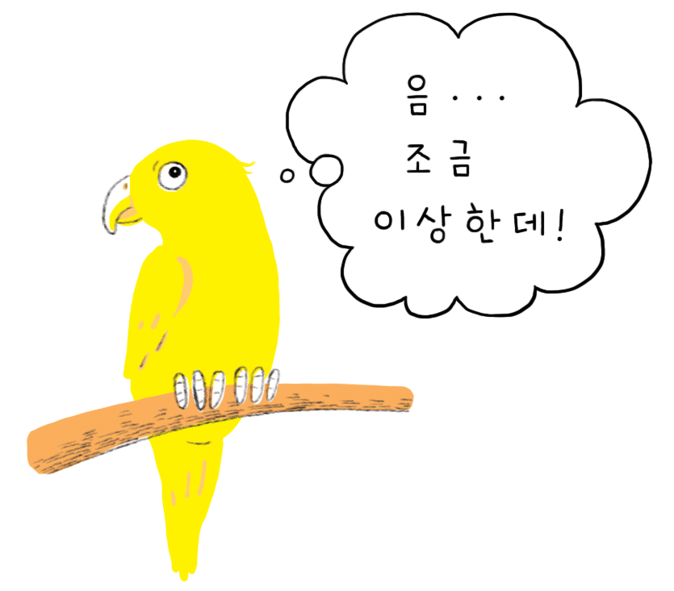

# 카드 뒤집기 마술 - 오류 탐지 및 수정 {#checksum}

::: {#checksum-activity .rmdnote}

## 활동 4 {#activity-four}

### 개요 {-}

데이터가 컴퓨터 디스크에 저장되거나 A 컴퓨터에서 B 컴퓨터로 데이터가 전송될 때, 
보통 데이터처리할 때 변경될 것이라고 생각하지는 않는다. 
하지만 때때로 데이터에 오류가 발생하고, 우연히 데이터 변경이 일어나기도 한다. 
이번 활동은 마술을 사용해서 손상된 데이터를 어떻게 탐지하고 오류난 데이터를 어떻게 교정하는지 익힐 것입니다.

### 교과학습 연계 {-}

- 수학: 정수론 레벨 3 이상. 연산과 추정 탐색
- 대수 레벨 3 이상. 패턴과 관계 탐색

### 기술 {-}

- 계수 (counting)
- 짝수와 홀수 인식

### 나이 {-}

- 9세 이상

### 학습 교재 {-}  

- 한쪽 면만 색칠된 냉장고 자석 36개 한 벌
- 시연을 위해서 자석이 붙을 수 있는 금속판 (화이트보드 추천)  
아이 한 쌍이 필요한 것
- 한쪽 면만 색칠된 똑같은 카드 36개

:::

## 언플러그드 동영상  {#avi-checksum}

| 한글 | 영어 |
:---------------------------------: | :-------------:|
| - | <iframe width="350" height="260" src="https://www.youtube.com/embed/-35-sPTYPJg" frameborder="0" allowfullscreen></iframe>|


## 마술 {#checksum-magic}

### 시연  

마술사가 될 기회가 있어요.  

동일한 양면 카드가 필요합니다. (한쪽 면만 색칠된 커다란 종이를 자르세요)
한쪽 면만 색칠된 평평한 냉장고 자석 카드를 사용하기가 시연 목적으로 좋습니다.

1.  다음과 같이 5 × 5 정사각형에 임의로 앞뒤가 뒤섞인 카드를 놓을 어린이를 고르세요.

{width=100%}


"조금 더 어렵게 만들도록" 추가로 행(row)과 열(column)을 덧붙이세요.

{width=100%}


추가되는 카드들이 묘기의 가장 중요한 요소입니다. 
추가되는 카드를 골라서 각 행과 열에 짝수 색깔 카드가 될 수 있도록 맞춥니다.  

2.  선생님이 눈을 감고 있는 동안 아이에게 카드 하나를 뒤집게 합니다. 
바뀐 카드를 가진 행과 열은 이제 홀수개의 색깔 카드를 가지게 되어서 바뀐 카드를 쉽게 찾을 수 있습니다.  

묘기가 어떻게 수행되었는지 아이들이 추론할 수 있을까요?

### 아이들에게 묘기 설명하기

1.  둘이 짝이 되어서, 어린이들이 5 × 5 카드를 자리에 놓습니다.  
2.  각 행과 열에는 얼마나 많은 색칠된 카드가 있나요? 짝수인가요, 홀수인가요? 기억하세요 0은 짝수입니다.  
3.  이제 각 행에 6번째 카드를 추가하는데, 색칠 카드가 항상 짝수가 되도록 합니다. 이 추가 카드를 패리터(parity) 카드라고 합니다.  
4.  아래쪽을 따라서 6번째 카드 행을 추가하는데, 각 열의 색칠 카드의 수가 짝수가 되도록 합니다.  
5.  이제 카드를 한 장 뒤집습니다. 행과 열에서 무엇을 눈치채셨습니까? (색칠 카드의 수가 홀수가 됩니다.) 
패리티 카드는 언제 오류가 발생했는지를 보여주기 위해 사용됩니다.  
6.  이제 순서를 바꿔서 ‘묘기’를 부려봅시다.
 
### 확장 활동

1. 다른 물체를 사용해 봅시다. 두 개의 상태를 가진 어떤 것도 무방합니다. 
예를 들어, 가지고 노는 카드, 동전(앞뒷면), 이진수 체계와 연관되도록 과 0과 1로 인쇄된 카드도 됩니다.  
2. 만약 두개 혹은 그 이상의 카드가 뒤집어진다면 무슨 일이 생길까요? (어떤 것이 변경되었다는 것을 말할 수 있지만, 
정확하게 어느 두 장의 카드가 뒤집혔는지를 꼭 집어서 말하는 것은 항상 가능하지는 않습니다. 
통상 두 짝의 카드 중에 하나로 범위를 좁힐 수 있습니다. 4장이 뒤집히는 경우, 
나중의 모든 패리티 비트가 정상일 수 있어서 오류가 탐지되지 않고 그냥 지나칠 수 있습니다.)  
3. 다른 흥미로운 카드놀이 연습은 오른쪽 아래 카드를 생각해 보는 것이다. 
위쪽 열에 대해서 올바른 것을 고른다면, 왼쪽 행에 대해서도 그럴까요? (답은 항상 그렇다 입니다.)  
4. 이 카드놀이 연습에서는 짝수 색칠 카드를 사용하여 짝수 패리티(even parity)를 사용했다. 
홀수 패리티(odd parity)로도 할 수 있을까? (가능하지만, 만약 행과 열의 숫자가 
모두 짝수이거나 홀수이면, 오른쪽 아래 카드는 행과 열에 대해서 같다. 
예를 들어, $5 \times 9$ 나 $4 \times 6$ 배치는 작동하지만, $3 \times 4$ 배치는 작동하지 않는다.)

## 오류 검사 실사례 &mdash;  ISBN 코드 {#checksum-in-practice}

동일한 검증 기법이 책코드에도 사용된다. 출판된 책은 책 뒷면에 10 자리 코드가 있다.
10 번째 자릿수는 검증 자리수로 카드놀이 연습에서 살펴본 패리티 비트(parity bit) 같은 것이다.  

ISBN (International Standard Book Number)을 사용한 책을 주문한다면, 출판사는 오류가
있는지 점검을 한다는 의미가 됩니다. 출판사는 간단히 체크썸(checksum)을 살펴볼 것입니다.
이와 같은 방식으로 여러분은 잘못된 책을 기다리다 끝나지 않게 됩니다.  

다음에 체크썸을 해결하는 방법이 있습니다.  

첫째 자리는 10 을, 둘째 자리는 9 를, 셋째 자리는 8 을, 계속해서 내려가서, 아홉번째 자리는
2 를 곱한다. 그리고는 이들 각 값을 하나이 값으로 합친다.  

예를 들어, ISBN 0-13-911991-4 는 다음과 같다.  


```r
(0 × 10) + (1 × 9) + (3 × 8) + (9 × 7) + (1 × 6) + (1 × 5) + (9 × 4) + (9 × 3) + (1 × 2) = 172  
```


그리고 이 값을 11 로 나눈다. 나머지는 무엇일까?  


```r
172 ÷ 11 = 몫 15 나머지 7
```


만약 나머지가 0 이면, 체크썸은 0 이다. 그렇지 않은 경우 11 에서 나머지를 빼서 체크썸을 얻는다.  


```r
11 – 7 = 4
```


다시 돌아가서, 이 숫자가 ISBN 의 마지막 숫자인가? 예 맞습니다.  

ISBN 의 마지막 숫자가 4 가 아니라면, 뭔가 잘못된 것을 알 수 있다.  

10 을 체크썸 값으로 가지는 것도 가능하다. 이 경우 한 자릿수를 추가로 필요로 한다. 
이것이 생겼을 경우, **X** 문자가 사용된다.

{width=100%}


검증 자릿수를 사용하는 또 다른 사례는 식료 잡화품에 붙어있는 바코드(bar code)다.
바코드는 다른 공식을 사용한다. 만약 바코드가 잘못 읽힌다면, 마지막 자릿수는 계산된
값과 달라야 한다. 이런 경우가 발생하면, 스캐너는 삑 소리를 내고, 계산원은 바코드를 다시 스캔한다.


## 항상 체크썸은 맞을까? {#checksum-verification}

{width=100%}

때때로 오류가 생깁니다.  

흔한 오류는 다음과 같습니다.  

- 숫자의 값이 변합니다.
- 두 인접한 숫자가 서로 뒤바뀝니다.
- 숫자가 중간에 삽입됩니다.
- 숫자가 빠져버립니다.  

체크썸 10 자리 문자 X 가 표기된 책을 찾을 수 있나요? 발견하기 어렵지 않을
것입니다. 모두 11 자리 중에 1 자리는 X 를 가져야 하기 때문입니다.  

탐지하기 어려운 오류는 어떤 것이 있을까요? 체크썸 값을 바꾸지 않고 숫자를
바꿀 수 있나요? 두 숫자가 바뀐다면 어떨까요? (흔한 컴퓨터 타이핑 오류)

## 컴퓨터 과학 핵심 개념 {#checksum-lesson}

10 달러 현찰을 은행에 예금한다고 가정해 봅시다. 은행 창구 직원이 예치금을 컴퓨터에
타이핑하면 입력된 정보는 중앙 컴퓨터로 전송됩니다. 
하지만, 예치금이 전송되는 동안에 회선에 장애가 발생했서 10 달러에 대한 코드값이 
1,000 달러로 바뀌었다고 생각해 봅시다. 
고객인 여러분의 입장에서는 문제가 아니지만, 분명 은행에게는 심각한 문제입니다.  

전송된 데이터에 오류가 있는지 탐지하는 것은 중요합니다. 그래서 정보를 수신하는 컴퓨터는 데이터가
회선에 전자기적 간섭에 의해서 손상되었는지를 검증할 필요가 있습니다. 
때때로, 오류도 함께 전송된 경우에는 원본 데이터를 다시 보낼 수도 있습니다. 
하지만, 만약 물리적, 열, 자기적 혹은 전기적 방사선에 노출되어 손상된 경우 
다시 전송하는 것이 여의치 못한 경우도 있습니다. 만약 저 먼 우주 탐사선으로부터 
데이터를 전송받았는데 오류가 발생했다고 다시 재전송되기를 기다리는 것은 매우 지루하고 시간이 많이 걸릴 것입니다. 
(목성이 지구에 가장 가까울 때, 목성으로부터 라디오 신호를 얻는데 30분 가량 걸립니다.)  

데이터가 언제 손상됐는지를 인지(*오류 탐지*, error detection)하고, 
원자료를 복원(*오류 수정*,
error correction)할 필요가 있습니다.  

“카드 뒤집기”에 사용된 동일한 기법이 컴퓨터에도 적용됩니다. 비트를 가상의 행과 열에
놓아, 패리티 비트를 각 행과 열에 추가함으써, 오류가 발생했는지 여부와 *어디*에서
발생했는지도 탐지할 수 있습니다. 
문제 비트는 다시 되돌려, 오류 수정을 수행합니다.  

물론, 컴퓨터는 복수의 오류를 탐지 수정할 수 있는 좀더 복잡한 오류 통제시스템을 사용합니다. 
컴퓨터 하드디스크는 오류 수정 목적으로 할당된 무척이나 넓은 저장공간을 가지고 있어서 디스크의 일부분이 고장
나더라도 잘 작동될 수 있습니다. 
이러한 목적으로 사용되는 시스템은 패리티 방식과 밀접한 관련이 있습니다.

> 이 활동을 끝난 후에 조크 하나.  
> Q: “Pieces of nine, pieces of nine”(아홉 조각, 아홉 조각)을 무엇이라 할까요?  
> A:  앵무새 오류 (parroty error)  

{width=100%}

## 해답과 힌트 {#checksum-solution}

1 개 숫자 값이 증가하고, 1 개 숫자 값이 줄어드는 경우에는 총합이 동일하기 때문에 오류가 탐지되지 않습니다.

