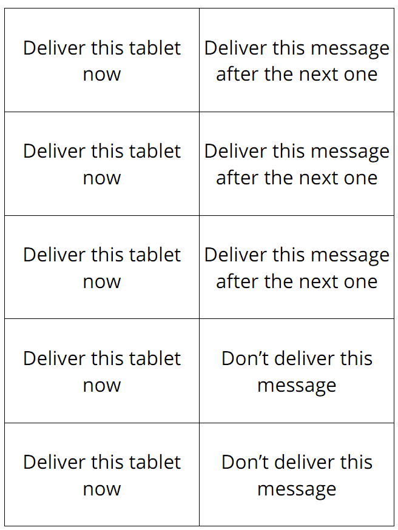
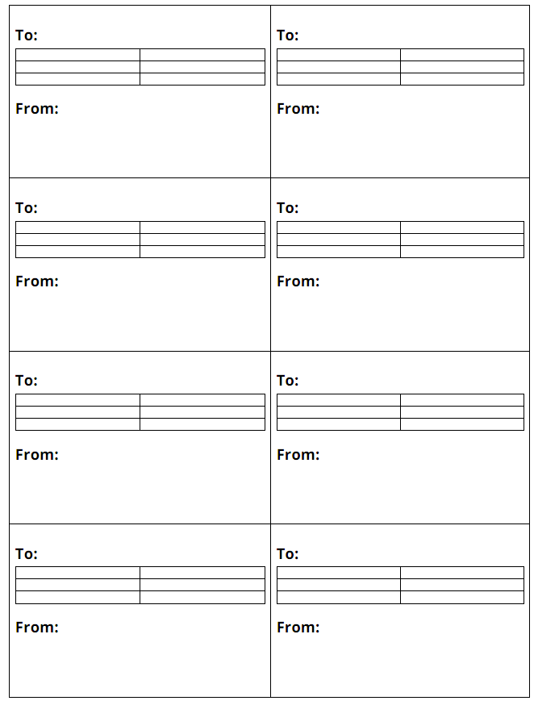

# 네트워크 통신 프로토콜 {#internet}

::: {#protocol-activity .rmdnote}

## 활동 10 {#activity-tenth}

### 개요 {-}

컴퓨터는 메시지를 통해 인터넷으로 서로 대화한다.
하지만, 인터넷은 신뢰성이 없어서, 때때로 메시지 일부가 유실되기도 한다. 
메시지에 특정 정보 일부(bits of information)를 추가해서 송신이 제대로 되었는지 확실히 한다. 
이 정보가 프로토콜을 구성한다.

### 교과학습 연계  {-}

- 수학 : 로직과 추론 개발
- 국어(English) : 의사소통, 대인관계 경청(interpersonal listening) 

### 기술  {-}

- 협력하여 문제 해결하기
- 논리적 추론하기

### 나이  {-}

- 9세 이상

### 학습 교재 {-}

- 각 아이들에게 필요한 것  
    - 많은 공백 `명판(Tablet)`  
- 각 배달원이 필요한 것  
    - 메시지 실행 카드 한 벌
- 선생님이 필요한 것  
    - 초시계  

:::

## 돌명판 {#internet-intro}

### 들어가며

이 활동에서 학생들은 어떻게 서로 다른 통신 방법이 성공적으로 운영될 수 있는지 생각하게 될 것이다.
장소에 규칙과 절차를 살펴봄으로써, 학생들은 통신 프로토콜에 자연스럽게 소개된다. 
역할극 시나리오를 직접 수행해봄으로써, 학생들은 신뢰성이 없는 환경아래에서 
자신만의 프로토콜을 검정하게 되는데, 인터넷 패킷 교환(packat switching), 
좀더 구체적으로 TCP/IP  환경과 유사하다.

### 준비 (30분)

1. 먼저 카드를 모은다. (아래) 활동카드를 출력하고 가위로 자른다. 
그럼 게임 준비가 되었다.

2. 다음, 학생이 전송할 메시지를 정한다. 
중요한 것은 메시지가 국문(영문) 문장이거나 구조를 다시 조합할 수 있는 것은 *안*된다. 
"1LHC255HD(RLLS" 같은 것이 적합한  메시지다 혹은 전화번호.

3. "명판(tablet)" 사본을 출력한다. 
각 명판은 문자 혹은 숫자 6개를 넣을 수 있는 자리가 있다. 
그래서, 한 명판에 전체 메시지를 전부 맞추어 넣을 수는 없다. 
얼마나 오랜 시간동안 게임을 할것인지에 달려있지만, 학생당 대략 명판 30개가 필요할 것이다.

**주의**: 활동카드가 3가지 유형이 있다&mdash; 지연(delay), 전달금지(don't deliver), 전달(deliver).

세가지 유형 활동 카드 비율을 조절해서 메시지 전달자 품질을 조정할 수 있다. 
"전달(deliver)" 활동카드를 좀더 많이 주면 좀더 신뢰성 있는 메시지 전달자가 된다. 
좀더 "지연(delay)"과 "전달금지(don't deliver)"를 주게되면, 
덜 신뢰성 있는 네트워크를 의미하게 된다. 
이러한 활동카드는 컴퓨터 네트워크/통신 채널과 유사하다.

### 게임하기

1. 학급을 쌍(pair)으로 나눈다. 서로를 볼 수 없게 하거나 서로 의사소통할 수 없게 각 쌍이 떨어져 앉아있게 하는 것이 매우 중요하다. 교실 두개가 이상적이지만, 교실  반대편에 학생들이 앉아 있는 것으로도 충분하다.

2. 한쪽에 다른 상대방에게 전달할 메시지를 나눠준다.

3. "활동카드(Action Cards)"를 섞고 메시지 전달자를 선정한다. 만약 홀수가 나오면, 그 학생이 메시지 전달자가 될 수 있다. 만약 학급이 크다면, 한명 이상의 메시지  전달자가 필요할 수 있다.

. 한 학생이 이제 명판에 적고 명판을 메시지 전달자에게 건내준다. 명판위에 적어도 다른 사람 이름이 있어야 한다.

. 메시지 전달자가 가장 위에 있는 활동카드를 뽑고, 뒤집어 읽고, 그것을 사용해서 명판으로 무엇을 할지 결정한다.

. 4번과 5번 단계를 각 명판으로 반복한다.

약 5분간의 혼란과 좌절 뒤에, 학생들은 이름만으로는 프로토콜로 충북히 만족스럽지 않다는 것을 깨달아야 한다. 
수업을 중단시키고, 토론하자... 학생들이 갖는 첫번째  이슈가 무엇일까? 
순서일까? 혹시, 6개 자리중에서 하나에 명판 숫자를 넣어 사용하는 것이 최선이 아닐까? 
이것이 의미하는 바는 실제 데이터에는 적은 공간이 할당된다는 의미가 된다 &mdash; 
이제 사용해야하는 명판 숫자에 관해서 이것이 의미하는 바는 무엇일까?

잠시 시간이 흐른 뒤에, 다른 문제를 알아챌지 모른다. 
이러한 문제도 또한 토의되어야 한다.
가능한 문제는 명판 분실이 될 수 있고 명판이 전달이 제대로 되었는지 알지 못하고, 
명판을 재전송했는지 알지 못하는 것도 있다. 제시할 수 있는 해결책은 받았다는 증명(acknowledgement)을 다시 보내고, 
또 다른 명판을 보내기 전에 받았다는 증명을 받을 때가지 기다린다 &mdash; 이것이 의미하는 바는 수신 학생에게도 또한 
메시지를 송신할 빈 명판이 필요하다는 것이다. 
그리고, 게임을 다시 시작하기 전에 문자 6개 응답이 무엇을 의미하는지 동의해야 할 것이다.

이 게임에 적어도 학생이 두 명 필요하다. 하지만, 가능하면 많은 학생을 갖기 추천한다.
만약 학급이 크다면, 메시지 전달자를 몇명 고려한다. 
다시 한번, 메시지 전달자 숫자를 학급에서 토의하자. 
만약 메시지 전달자가 많다면 무엇이 발생할까? 
만약 메시지 전달자가 한명이면 무엇이 발생할까?

## 활동: 활동 카드  {#internet-worksheet}

{width=100%}

 
## 활동: 메시지 전달 {#internet-worksheet-message}

{width=100%}

## 돌명판 {#tablet-of-stone}

고대 도시에는 매우 중요한 통치자(Governors)가 많았다. 
통치자는 도시가 어떻게 운영되어야 하는지를 결정하고 매우 중요한 결정을 내린다. 
통치자 각자는 도시 도처에  서로 다른 집에서 살았다.

통치자들은 종종 통신하고자 했으며, 도시 도처에서 메시지를 주고 받을 필요가 있었다. 
통치자는 본인이 살고 있는 집번호로 식별되었고, 
통치자는 모두 메시지를 전달하는 것을 업으로 하고 있는 메시지 전달자(messenger) 집단에 접근할 수 있다. 
 
메시지를 전송하는 유일한 방식은 커다란 사각형 돌명판(table of stone)에 적는 것이었다. 
메시지 전달자는 돌명판을 가지고 목적지까지 들고갔다. 
돌명판은 크기가  고정되어서 돌명판에는 정보로 6 조각만 맞춰 넣을 수 있다. 
정보 한조각은 문자 하나 혹은 숫자 하나가 될 수 있다. 
메시지는 다수 명판에 쪼개질 수 있고, 명판이 매우  무겁기 때문에 한번에 하나만 옮겨 전달 될 수 있다.

메시지 전달자가 건망증이 심하고 게으르기 때문에 항상 올바른 메시지를 전달할지 신뢰를 가질 수 없다.
종종 근무시간에 너무 오래 휴식을 취하거나 도시를 탈출하여 도망가기도 한다.

통치자는 통신을 신뢰성있게 만들 방법을 찾고 싶고, 
통치자 모두가 따를 수 있는 규칙 집합을 개발하고자 한다. 
이렇게 함으로써, 메시지가 전달여부와 메시지가 올바르게 맞는 것인지 알 수 있다. 
통치자는 이미 명판에 목적지가 명시되어야 한다고 결정했다.
 
여러분이 속한 집단에서, 수행할 작업은 통치자가 통신에 사용할 규칙을 개발하는 것이다...

## 컴퓨터 과학 핵심 개념 {#internet-lesson}
 
인터넷에서, 데이터는 전송을 위해서 패킷(package)으로 쪼개진다. 
하지만, 패킷이 돌아다니는 경로(channel)가 항상 신뢰성이 있는 것은 아니다. 
때때로 개별 패킷은  손상되고, 유실되거나 순서를 잃어버리기도 한다.
 
돌명판에서, 명판(tablet)이 패킷이 되고 명판의 내용이 데이터가 된다. 
패킷은 데이터와 *헤더(header)* 정보를 담고 있다. 
헤더정보 크기가 얼마나 많은 정보가 전송될 것인지에 영향을 미친다 &mdash; 패킷 크기가 유한하기 때문에 균형을 맞추어야 한다.

TCP와 UDP 같은 인터넷 프로토콜은 신뢰성 있고 효율적인 데이터 전송을 할 수 있도록 이런 요인을 잘 균형맞춘다.

여기 활동은 `컴퓨팅 과학의 안쪽(Computing Science Inside)` 프로젝트 중 하나를 차용해서 변형했다. [출처](http://csi.dcs.gla.ac.uk)

