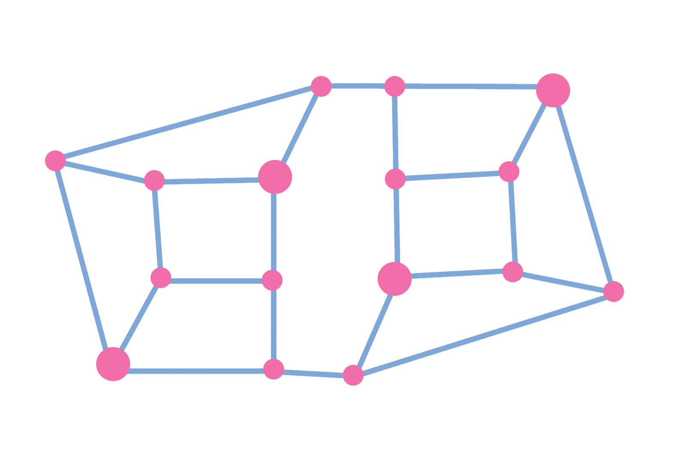
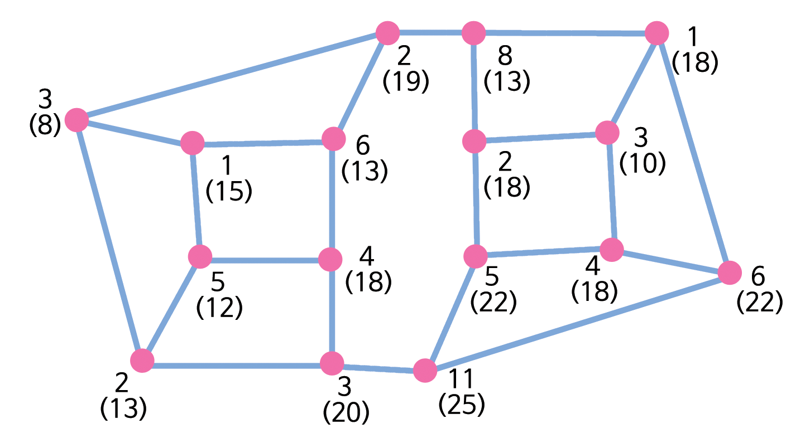
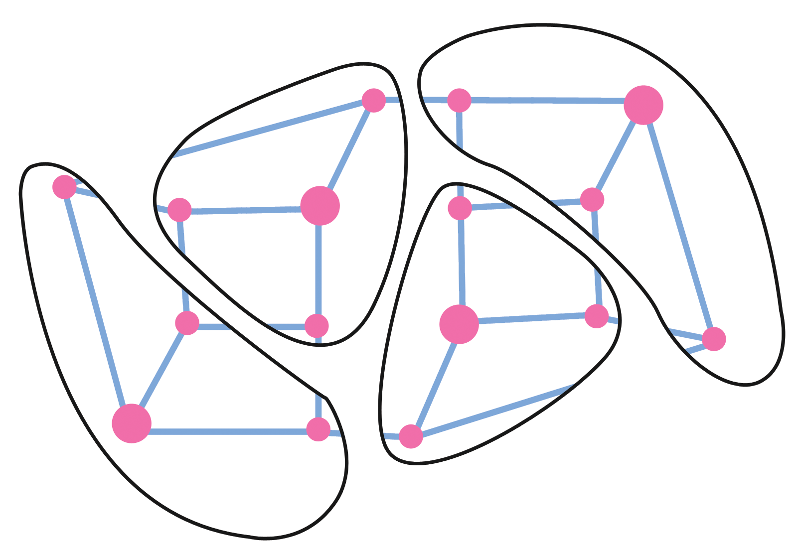
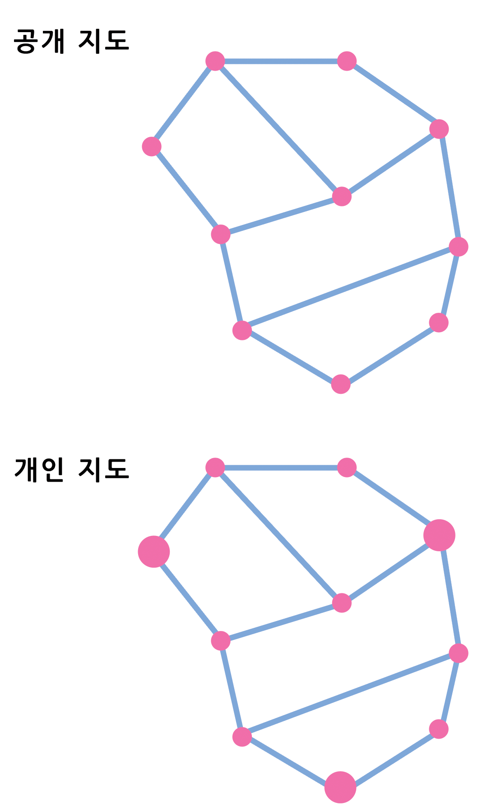
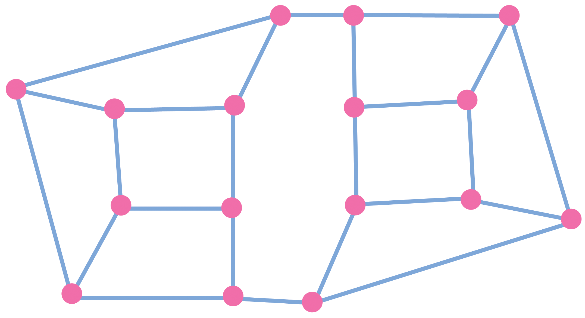

# 공개키 암호화 {#public-key}

::: {#public-key .rmdnote}

## 활동 19 {#activity-19}

### 개요  {-}

암호화는 정보 보안에 열쇠이다. 현대 암호화의 열쇠는 공개 정보만 사용하여 발시자가 
메시지를 잠그고, 받는 수신자가 메시지를 (물론 개인적으로) 푸는 것이다.  

마치 사람들이 맹꽁이자물쇠를 구매하고, 자물쇠 위에 이름을 적고, 다른 사람도 사용하는 동일한 탁자위에 올려 놓는 것과 같다. 물론 열쇠는 별도로 보관한다&mdash; 맹꽁이자물쇠는 클릭해서 잠그는 유형의 것이 된다. 만약 비밀 메시지를 내가 상대방에게 보내려고 한다면, 메시지를 상자에 담고, 맹꽁이자물쇠를 집어들고, 상자와 채결하여 참그고, 상대방에게 전송한다. 설사 잘못된 사람에게 전달되더라도, 그 누구도 풀 수 없다. 이 기법을 사용해서, 사전 통신으로 비밀 코드를 정렬할 필요는 없다.   

이번 활동을 통해서 디지털로 어떻게 이러한 것이 가능한지 확인한다. 그리고 맹꽁이 자물쇠를 사용하는 대신에, 디지털 세상에서는 자물쇠를 복사하고, 사용하고, 탁자위에 원래 자물쇠를 놓는다. 만약 물리적인 맹꽁이 자물쇠 사본을 만들려고 하면, 분해해서 사본을 만들 수 있다. 분해해서 복제본을 만드는 과정을 통해서 불가피하게 동작하는 메커니즘을 파악하게 된다. 하지만, 디지털 세상에서는 열쇠를 찾지 못하게 하고서 자물쇠를 복사하게 할 수 있다.    

불가능하게 들리나요? 읽어 보세요.  

### 교과학습 연계  {-}

- 기술 레벨 3: 기술 시스템.  
기호 언어 도구를 사용하여 기술 시스템을 표현하는 것을 이해한다. 
기술 시스템에서 블랙박스의 역할을 이해한다.  

### 기술  {-}

- 퍼즐 풀기 (Puzzle solving).  
- 비밀 번호 (Secret codes).  

### 나이  {-}

- 11세 이상

### 학습 교재  {-}

- 학생은 4명이 한 조가 되는 그룹을 만든다. 각 그룹안에 두개의 소그룹을 만든다. 
각 소그룹에 *키드 크립토 지도* 워크시트 사본지도 두장을 나눠준다. 그래서, 각 그룹 학생들이 필요한 것:
    - *키드 크립토 지도* 사본 2장.  
- 선생님이 필요한 것:  
    - 키드 크립토 인코딩 빔 프로젝트 슬라이드.  
    - 다이어그램에 주석 다는 방법.  

:::

## 언플러그드 동영상  {#public-key-avi}

| 한글 동영상 | 영문 동영상 |
:---------------------------------: | :-------------:|
| `-` | <iframe width="350" height="260" src="https://www.youtube.com/embed/jJrICB_HvuI" frameborder="0" allowfullscreen> </iframe> |

## 키드 크립토  {#public-key-intro}

{width=100%}

### 들어가며

이 책에서 이번 활동이 기술적으로 가장 도전적인 활동이다. 보람이 있지만, 꼼꼼함과 더불어 성공적으로 완수하기 위해서 지속적인 집중이 요구된다. 관광 마을 학습 14 에서 일방향 함수를 이미 학생들이 공부했다. 만약 다른 활동 (비밀 공유 활동 16, 페루 동전 던지기 활동 17) 들을 완료했다면 도움이 된다. 또한 활동 1 이진수 세기, 활동 5 질문 20개에서 다룬 아이디어도 사용된다.  
 
애미(Amy)는 빌(Bill)에게 비밀 메시지를 보내려고 계획중이다. 일반적으로 비밀 메시지를 문장 혹은 문단으로 생각한다. 하지만, 다음 예제에서, 애미는 단지 한 문자만 전송한다&mdash; 사실 문자를 나타내는 숫자 하나만 전송한다. 단순한 메시지같아 보이지만, 문장을 구성할 수 있는 "메시지" 전체 문자열을 전송할 수 있다는 것을 명심하라. 실무에서는 컴퓨터가 작업을 수행한다. 종종 작은 메시지조차도 중요하다&mdash; 폴 리비어가 전달한 역사상 가장 유명한 메시지도 단지 가능한 두 값만 있다. 빌의 공개 자물쇠를 이용하여, 애미가 암호화된 메시지에 숫자를 내장한 방법을 살펴볼 것이다. 그래서, 만약 누군가 메시지를 가로채도 메시지를 해독할 수 없을 것이다. 단지 빌만 해독할 수 있는데 이유는 자물쇠에 열쇠를 빌만 가지고 있기 때문이다.      
 
*지도*를 사용해서 메시지를 잠근다. X가 보물의 위치를 표시하는 보물섬 지도와 달리, 선은 도로를 점은 교차점을 나타내는 활동 14 관광 마을에서 사용된 도로지도와 유사하다. 각 지도는 공개 버젼(자물쇠)과 개인버젼(열쇠)로 되어있다.  

### 토론

*키드 크립토 인코딩* 워크쉬트에 빌의 공개지도가 있다. 공개지도는 비밀이 아니다: 빌은 누구나 볼 수 있게 탁자 위에 (혹은 웹상에) 지도를 놓거나, 메시지를 보낼 사람에게 전달한다. 애미에게 사본이 있듯이 누구나 사본을 가질 수 있다. 다음은 빌의 개인 지도다. 빌의 공개지도와 동일하지만, 몇몇 교차점은 크게 확대 표시되어 있다. 개인지도 버젼을 잘 간직한다.  

{width=100%}

최소한 시작은 한 학급 활동으로 진행하는 게 좋다. 왜냐하면, 작업량이 상당하기 때문이다. 어렵지는 않지만, 정확하게 수행되어야 한다. 왜냐하면 오류가 많은 문제를 불러 일으키기 때문이다. 이런 유형의 암호화 작업을 수행하는게 얼마나 놀라운 것인지(불가능하게 보이지만, 그렇지 않다) 학생들이 깨닫게 하는게 중요하다. 왜냐하면, 끝까지 진행하려면 노력이 들고 동기가 필요하기 때문이다. 학교 학생들에게 동기 부여가 되는 한가지는 이 방법을 사용하면 수업시간에 비밀 노트를 학생들 사이에 주고받을 수 있다는 것이다. 설사 선생님이 비밀 노트가 어떻게 암호화되었는지 파악하더라도, 해독을 할 수 없이다.    

1. 빌의 공개지도(*키드 크립토 인코딩* 워크쉬트) 보여준다. 애미가 전송할 숫자를 결정한다. 지도 교차점에 난수를 위치시킨다. 그래서 난수를 모두 더하면 애미가 전송할 숫자가 된다. 다음 그림은 교차점 옆에 괄호치지 않은 상단의 숫자는 한 예가 된다. 여기서, 애미는 숫자 66을 전송하려고 골랐다. 그래서 괄호치지 않은 교차점 상단 숫자를 모두 더하면 66 이 된다. 필요하다면, 원하는 숫자를 맞추려고 음수도 사용가능하다.  

{width=100%}

2. 이제 애미가 빌에게 보낼 것을 계산해야 한다. 만약 애미가 숫자가 적힌 지도를 송부한다면, 좋지 않다. 왜냐하면, 나쁜 사람 손에 지도가 들어가면, 숫자를 모두 더해서 메시지를 해독할 수 있기 때문이다.  
 
대신에, 교차점을 골라, 그 지점과 주변 점&mdash; 총 교차선은 4개&mdash;, 그 지점의 총합을 조사한다. 괄호 안에 혹은 다른 색깔 펜으로 교차점에 숫자를 기입한다. 예를 들어, 예제로 나온 공개지도 그림에서 가장 오른쪽 교차점(6)은 다른 세점(1,4,11)과 연결되었다. 그래서 총합은 22가 된다. 이제 이과정을 지도에 있는 모든 교차점에 반복하자. 이과정을 반복하면 공개지도에 괄호에 있는 숫자가 된다.   
  
3. 애미가 빌에게 지도를 송부한다. 지도에는 괄호에 있는 숫자만 적혀 있다.  

원래 숫자를 지우고, 애미가 송부하는 숫자만 남겨놓거나, 새로운 지도를 만들어서 숫자를 적어 넣어라. 원본 메시지와 전송하려고 준비한 메시지를 분간할 수 있는지 학생들에게 물어본다. 분간할 수 없을 것이다.    

4. 빌의 개인키를 소유한 사람만이 원래 애미가 전송하려는 메시지를 찾아 해독할 수 있다. 암호화된 메시지 위에 빌의 개인 지도에 특별히 확대된 노드를 표식하라.  
메시지를 해독하기 위해서, 빌은 단지 표식된 비밀 교차점에 적힌 숫자를 더하면 된다. 예제에서, 교차점은 13, 13, 22, 18 이고, 모두 더하면 66 으로, 애미의 원래 메시지가 된다.   
 
5. 어떻게 작동하는 것일까? 지도가 특별제작된 것이다. 빌이 표식된 교차점 중 하나를 골라 그것을 중심으로 한 블록 떨어진 교차점들 주위를 줄을 긋고, 표식된 다른 교차점에도 반복한다고 가정하자. 다음에 보여주듯이, 서로 겹치지 않는 조각으로 지도를 쪼개게 된다. 지도에 경계를 그려서 학생들에게 조각을 보여준다. 각 조각에 교차점 그룹은 정확하게 표식된 교차점에 전송될 숫자로 사용될 합이 된다. 그래서 각 교차점의 네개 전송 숫자의 합은 최초 지도에 있는 모든 최초 숫자를 총계가 된다. 
 
휴, 문자 하나를 전송하는데 엄청난 일처럼 보인다. 그리고 문자 하나를 전송하는 것은 사실 엄청난 일이 맞다. 암호화는 쉬운 일이 아니다. 하지만, 성취한 것을 살펴보자: 참여자가 간에 사전에 어떤 약속도 필요없는, 공개키를 사용한 완벽한 비밀성. 공개된 게시판에 공개키를 게시하고, 누구나 여러분에게 비밀 메시지를 보낼 수 있다. 하지만, *어느 누구도* 비밀키 없이는 해독할 수 없다. 실생활에서 모든 연산은 여러분이 구입한 소프트웨어 팩키지(일반적으로 웹브라우져에 내장된)로 수행되어서, 정말 열심히 일하는 것은 컴퓨터다.

{width=100%}

아마도 여러분 학급이 수작업으로 공개키 암호화를 실제 작업한 매우 선택된 사람만으로 구성된 것을 알게 될 것이다&mdash; 실무에서 뛰는 컴퓨터 과학자는 이러한 작업을 거의 불가능하다고 생각하고 거의 이 작업을 수행한 사람이 없다!  
 
이제, 도청은 어떨까? 빌의 지도는 관광 마을(활동 14)에 있는 것과 같다. 관광 마을에서 표식된 교차점이 누구나 한 블록이상 걷지 않고 아이스크림을 팔 수 있는 아이스크림 승합차를 위치시키는 최소 방법이다. 관광 마을에서 빌은 쉽게 개인지도로 시작해서 그런 지도를 만들어 내기가 쉽지만, 무작위 방법(brute-force method)을 제외하고 아이스크림 승합차를 위치시킬 최소 방법을 다른 사람이 찾기는 어렵다는 것을 봤다. 무작위 방법은 승합차 한대로 모든 가능한 배치 위치를 시도하고, 두대로 시도하고, 승합차 댓수를 증가 시키면서 반복하는데, 최적의 해결책이 찾아질 때까지 계속한다. 아무도 일반적인 지도에서 더 나은 방법이 있는지 알지 못한다&mdash; 정말 많은 사람들이 해답을 찾으려고 노력했다는데 내기를 걸 수도 있다.    

빌이 가령 오십 혹은 수백개 교차점을 가진 충분히 복잡한 지도로 시작했다면, 어느 누구도 암호를 해독할 것 같지 않다&mdash; 심지어 가장 똑똑한 수학자도 풀려고 열심히 노력했지만 실패했다. ( 하지만, 주의할 점이 있다: 다음 *컴퓨터 과학 핵심 개념* 참조바란다.)  

6. 전체 학급이 예제 하나를 가지고 작업했으니, 학생을 예를 들어 4명, 그룹으로 나눠라. 각 그룹을 짝지어서 *키드 크립토 지도* 워크쉬트에 공개지도를 나눠준다. 짝지은 학생들은 "메시지"(임의 정수)를 골라, 공개키로 암호화하고, 다른 그룹에게 전달한다. 다른 그룹은 해독을 시도해 본다. 개인지도를 전달해줄 때까지 아마도 성공하지 못할 것이다. 개인지도를 나눠주고 올바르게 해독할 수 있는지 살펴본다.  

7. 이제 자신만의 지도를 짝을 지어 설계해보자. 개인버젼은 잘 보관하고 공개버젼만 다른 짝에게 전달한다&mdash; 사실 교실 칠판이나 게시판에 게시해도 된다. 지도를 설개하는 원칙은 관광 마을 활동에서 토의한 것과 동일하다. 추가 도로를 추가해서 정답을 위장한다. "특별한" 교차점에 추가 선을 연결하지 않도록 주의한다. 특별한 교차점을 연결하게 되면, 아이스크림 승합차 *두대*가  호프(hop) 하나로 바로 연결되게 되는데 관광 마을 상황에서는 문제가 되지 않지만, 암호화할 때는 큰 혼란이 생길 수 있다. 이유는 개인 지도에 보여주듯, 특별한 점이 *서로 겹치지 않는* 조각으로 지도를 더이상 분해하지 못하기 때문이다. 이것이 공개키 암호화를 동작하는데 핵심이다.  

## 활동: 키드 크립토 지도 {#public-key-worksheet}

{width=100%}

본문에 기술된 지도를 사용해서 메시지를 암호화하고 암호를 푼다.

## 활동: 키드 크립토 인코딩) {#public-key-kid-krypto}

지도를 학급에 보여주고, 메시지를 인코딩하는 것을 시연하는데 다음 그림을 사용하세요.

{width=100%}

## 컴퓨터 과학 핵심 개념 {#public-key-lesson}

컴퓨터 네트워크를 통해서 수신자만 제외하고 아무리 똑똑하고 열심히 노력하더라도 관계없이 그 누구도 해독할 수 없는 비밀 메시지를 보내려는 이유가 명확해졌다. 물론 *만약* 보내는 사람과 받는 사람이 비밀코드를 공유한다면 메시지를 교환할 수 있는 다양한 유형의 방법이 있다. 하지만, 공개키 암호화의 좀더 똑똑한 부문은 애미가 빌에게 비밀 메시지를 사전에 어떠한 비밀 약속도 없이 보낼 수 있다는 것이다. 단지 웹 페이지 같은 공공장소에서 자물쇠를 고르면 된다.  

비밀성(secrecy)은 암호화의 단지 한 면에 불과하다. 또 다른 면은 인증(authentification)이다: 애미가 빌로부터 메시지를 받았을 때, 다른 사기꾼이 아니고 빌이 보냈다는 것을 어떻게 알 수 있을까? 누군가 다음과 같이 전자우편을 보냈다고 가정하자.

> "자기야, 나 돈이 없어서 여기서 꼼짝할 수 없어. 
> 내 계좌로 십만원만 넣어줘. 계좌 번호는 우리은행 0241-45-784329 이야.
> 사랑해, 빌.

애미는 정말 빌이 전자우편을 보낸 것인지 어떻게 알 수 있을까? 몇가지 공개키 암호시스템이 또한 사용될 수 있다. 애미가 빌에게 공개키로 메시지를 인코딩해서 메시지를 보냈듯이, *개인키*로 메시지를 암호화해서 *빌만 생성할 수 있는* 메시지를 애미에게 보낼 수 있다. 만약 애미가 빌의 공개키로 암호를 풀 수 있다면, 메시지는 빌에서부터 온 것이 틀림없다. 물론, 키가 공개되었기 때문에 누군가 암호를 풀 수 있다. 하지만, 만약 메시지가 애미만을  위한 것이라면, 빌이 애미의 공개키로 두번 암호화할 수 있다. 이러한 이중 암호화는 공개키와 개인키 기법을 사용하여 비밀성과 인증을 모두를 제공한다.  
 
이번 활동에 실제로 보여진 기법은 실제 산업에서 사용되는 공개키 암호화 시스템과 매우 유사하다는 것을 인정할 때가 지금이다. 실제 산업에서는 훨씬 더 커다란 지도가 사용되더라도, 사실 안전하지는 *않다.*  

이유는 설사 임의 지도 위에 아이스크림 승합차를 배치할 최소 방법을 찾을 길이 없어서 이러한 관점에서 사실 이 기법이 안전하다. 보안을 뚫는 완전히 다른 방식이 있을 수 있다. 이 아이디어가 학교 학생, 최소한 고등학교 수준까지 생길 것 같지는 않다. 하지만 존재한다는 것은 최소한 알아야 한다. 지금까지 조사한 기법은 학교학생 안전한 방식이고, 수학자 안전한 방식은 아니다. 만약 수학에 관심이 없다면 다음을 무시하세요!  
 
지도상에 교차점을 1, 2, 3, ... 번호를 매긴다. 교차점에 원래 숫자를 $b_1, b_2, b_3, ...$ 을 대입하고, 실제 전송되는 숫자를 $t_1, t_2, t_3, ...$ 으로 표기한다. 교차점 1 이 교차점 2, 3, 4 와 연결되었다고 가정하자. 그렇다면, 해당 교차점에 전송되는 숫자는 다음과 같다.  

$t_1 = b_1 + b_2 + b_3 + b_4$  

물론, 다른 모든 교차점에도 비슷한 방정식이 있다&mdash; 사실, 미지수 $b_1, b_2, b_3, ...$ 와 동일 갯수 방정식이 있다. 도청하는 사람은 공개지도와 전송되는 숫자 $t_1, t_2, t_3, ...$ 을 알고 있다. 따라서 방정식을 작성하고 방정식 푸는 컴퓨터 프로그램으로 문제를 풀 수 있다. 원래 숫자가 얻어지면, 메시지는 숫자 합이다&mdash; 사실 암호해독 지도를 찾을 필요도 없다. 가우스 소거법(Gaussian elimination)을 사용해서 방정식을 푸는데 드는 컴퓨터 노력은 방정식 갯수의 세제곱에 비례한다. 하지만, 방정식이 희소(sparse)하기 때문에&mdash; 계수 대부분은 0 &mdash; 좀더 효과적인 기법이 존재한다. 이 방법과 기하급수적 노력이 드는 것과 대조해보자. 누구나 알고 있지만, 최선의 노력은 암호해독 지도를 가져오는 것이다.  

속았다는 느낌을 받지 않았으면 한다. 사실 실제 공개키 암호시스템에 관계된 절차는 살펴본 것과 암호화에 사용된 방식이 다르다는 것을 제외하고 거의 동일하다&mdash; 사실 손으로 계산하는 것은 가능하지 않다. 여전히 가장 안전한 방법중의 하나인 최초 공개키 방법은 큰 숫자를 소인수 분해하는 어려움에 기반한다.  
 
9,412,343,607,359,262,946,971,172,136,294,514,357,528,981,378,983,082,541,347,532,211,942,640,121,301,590,698,634,089,611,468,911,681 백자리 숫자를 소인수 분해결과는 무엇일까? 너무 많은 시간을 쓰지 마세요.
 
정답은 86,759,222,313,428,390,812,218,077,095,850,708,048,977 과  108,488,104,853,637,470,612,961,399,842,972,948,409,834,611,525,790,577,216,753 이다. 다른 소인수는 없다: 두 숫자는 모두 소수다. 소수를 찾는 것은 엄청난 작업이다: 사실, 슈퍼컴퓨터로 7개월 프로젝트다.  
 
지금 실제 공개키 암호시스템에서 빌이 공개키로 100 자리 숫자와 개인키로 두 소인수를 사용했다. 그런 키가 어려운 것은 아니다: 필요한 것은 큰 소수를 계산하는 방식이다. 충분히 큰 두 소수를 찾아서(어렵지 않다.), 둘을 곱하면, 매우 빠르게 공개키가 된다. 매우 큰 숫자를 곱하는 것은 컴퓨터에게 큰 작업이 아니다. 공개키가 주어진 상태에서, 슈퍼컴퓨터를 몇달 사용하지 않는다면, 개인키를 누구도 알아낼 수 없다. 그리고 만약 걱정이 된다면, 100자리 소수 대신에 200 자리 소수를 사용하라&mdash; 몇년더 걸릴 것이다. 주요점은 키를 해킹하는데 소요되는 비용이 해킹해서 얻는 정보의 가치보다 높다는 것이다. 실무에서 512 비트 혹은 좀더 큰 키가 보안 연결설정에 흔히 사용되는데, 십진수로 약 155 자리수 이상과 상응한다.  

아직까지 소수기반 공개키를 사용하여 메시지를 암호화하는 방식을 학습하지 않아서 개인키 없이는 암호를 풀 수도 없다. 이것을 위해서, 실제는 앞에서 알아본 것처럼 간단하지 않다. 두 소수가 개인키로 두 소수의 곱이 공개키로 사용되는 것은 아니다. 대신에 두 소수에서 얻어진 숫자가 사용된다. 하지만 효과는 동일하다: 숫자를 소인수 분해해서 암호를 풀 수 있다. 어쨌든, 이런 어려운 점을 극복하고, 적절한 암호화 및 암호해독 알고리즘으로 개조하는 것은 어려운 것은 아니다. 하지만 여기서는 거기까지 상세히 다루지 않을 것이다. 이번 활동은 이미 충분한 학습이 되었다.   
 
소수에 기반한 시스템은 얼마나 안전할까? 글쎄요, 큰 숫자를 인수분해하는 것은 수세기 동안 세상에서 가장 저명한 수학자의 관심을 끌어온 문제다. 모든 가능한 소인수를 시도하는 무작위 방법보다 훨씬 더 나은 방식이 발견되었지만, 아무도 정말 빠른 (즉, 다항시간) 알고리즘을 제시하고 있지는 못하다. (어느 누구도 아직 그런 알고리즘은 불가능하다는 것도 증명하지 못했다.) 그래서 기법이 학교학생-보안 뿐만 아니라 수학자-보안처럼 보인다. 하지만 주의하라: 우리 모두 조심해야 한다. 관광 마을 문제를 풀지 않고 빌의 암호를 해독하는 방식이 있듯이, 큰 숫자를 인수분해하지 않고도 소수 암호를 해킹할 수 있는 방법이 있는지도 모른다. 사람들이 이 문제에 대해서 주의깊이 점검했다. 괜찮아(OK) 보인다.  

또다른 걱정이 만약 단지 몇개 가능한 메시지만 있다면, 침입자가 공개키를 사용해서 메시지를 순차적으로 암호화하고, 실제 메시지와 모든 경우의 수를 비교할 수 있다. 애미의 방법은 이것을 피할 수 있는데, 왜냐하면 무슨 숫자를 골라 코드 값을 더하는지에 따라 동일한 메시지를 암호화하는 방법이 많기 때문이다. 매우 빠른 컴퓨터의 도움을 받아도 시도해 보기에 너무나도 많은 메시지가 있도록 실무에서 사용되는 암호시스템은 설계된다.  
 
소수 인수분해 문제를 푸는 빠른 방법이 존재하는지 알려져 있지 않다. 어느 누구도 방법을 고안하지도 못했지만, 빠른 방법이 불가능하다고 증명도 되지 않았다. 만약 이 문제에 대한 빠른 알고리즘이 발견된다면, 현재 사용되는 많은 암호화 시스템이 안전하지 않게 될 것이다. 제4부에서 NP-완전 문제를 토론했다. 함께 흥하고 함께 망한다: 만약 문제 중에 하나가 효율적으로 풀 수 있다면 다른 문제도 마찬가지로 풀 수 있어야 한다. 이 문제에 대한 빠른 알고리즘을 찾는데 너무나 많은 (성공하지 못한) 노력이 투여되었기 때문에, 안전한 암호화 시스템을 설계하는데 사용할 훌륭한 후보자처럼 보이다. 슬프게도, 이 계획에는 어려운 점이 있다. 지금까지 암호시스템 설계자는 사실 NP-완전 문제보다 풀기 쉬울 수 있는 (소인수 분해 같은), 어쩌면 훨씬 더 쉬운, 문제에 의지할 수 밖에 없었다. 지금까지 제기된 문제에 대한 해답은 산업계에 수십억원의 가치가 있고, 국가 안보에 극히 중요한 것으로 간주된다. 현재 암호화는 컴퓨터 과학에서 매우 역동적인 연구분야다.>   

### 추가 읽기  

Harel이 저술한 *Algorithmics* 책에서 공개키 암호화를 논의한다; 어떻게 매우 큰 소수를 사용해서 안전한 공개키 시스템을 만들어 내는지 설명한다. 암호화에 대한 표준 컴퓨터 과학 교과서는 Dorothy Denning이 저술한 *Cryptography and data security*이다. 반면에 좀더 실무적인 책은 Bruce Schneier가 저술한 *Applied cryptography*다. Dewdney가 저술한 *Turing Omnibus*에는 공개키 암호화하는 또다른 시스템을 기술하고 있다.

